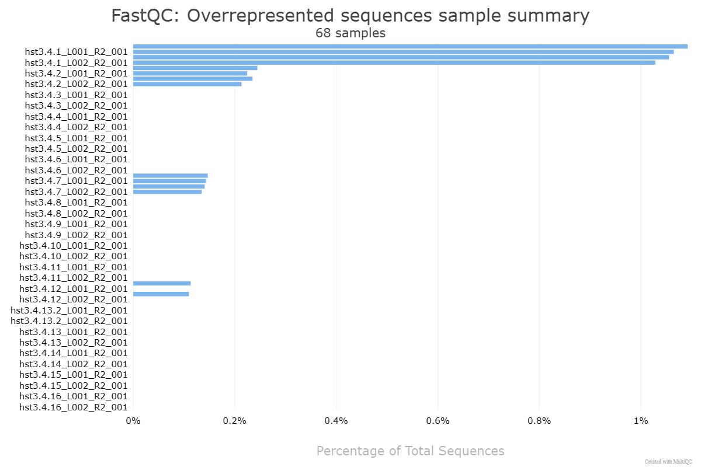

<div align='center'>

# Genome-wide mutation patterns in *hst3Δ* *hst4Δ* yeast strain:
# Insights into AID/APOBEC-mediated mutagenesis
</div>

## Authors
A. Shipunova¹², A. Zhuk⁴, E. Stepchenkova²³

1. Bioinformatics Institute, Kantemirovskaya st. 2A, 197342, St. Petersburg, Russia  
2. Department of Genetics and Biotechnology, St. Petersburg State University, 199034, St. Petersburg, Russia  
3. St. Petersburg Branch, Vavilov Institute of General Genetics, 199034, St. Petersburg, Russia  
4. ITMO University, 197101, St. Petersburg, Russia

## Project description

This repository contains the complete workflow for analyzing mutation patterns in *Saccharomyces cerevisiae* strains lacking *HST3* and *HST4* histone deacetylase genes. The pipeline identifies AID/APOBEC-associated single nucleotide variants (SNVs) and mutational clusters using whole-genome sequencing data.

## Environment setup
We recommend using **Conda** to manage the computational environment.

### Create conda environment

```bash
conda env create -f environment.yml
conda activate test_p12
```
## Input files

- **Raw FASTQ files**: Place paired-end `.fastq.gz` files in the folder:
`Genomes_hst3.4/Sample_{clone_name}`

- **Reference genome**: Download and place the file `GCF_000146045.2_R64_genomic.fna` in the working directory.

```bash 
wget https://api.ncbi.nlm.nih.gov/datasets/v2/genome/accession/GCF_000146045.2/download?include_annotation_type=GENOME_FASTA&include_annotation_type=GENOME_GFF&include_annotation_type=RNA_FASTA&include_annotation_type=CDS_FASTA&include_annotation_type=PROT_FASTA&include_annotation_type=SEQUENCE_REPORT&hydrated=FULLY_HYDRATED
```
## Pipeline overview


### Step 1: Quality Control with Snakemake
We use the initial Snakemake workflow to perform FastQC and MultiQC to generate HTML reports:
```bash
snakemake -s Snakefile_QC --cores 10
```

Our analyses identified overrepresented sequences in the clones hst3.4.1, hst3.4.2, hst3.4.7, and hst3.4.12.


### Step 2:  Manual Trimming with fastp

 We ran fastp manually for two sequencing lanes (L001 and L002), as an `adapter_sequence` we used overoverrepresented sequences for every clone:

 ```bash
 for lane in L001 L002; do 
  fastp \
    -i Sample_hst3.4.12/hst3.4.12_*_${lane}_R1_001.fastq.gz \
    -I Sample_hst3.4.12/hst3.4.12_*_${lane}_R2_001.fastq.gz \
    -o ./trimmed_fastq/trimmed_hst3.4.12_${lane}_R1_001.fastq.gz \
    -O ./trimmed_fastq/trimmed_hst3.4.12_${lane}_R2_001.fastq.gz \
    --adapter_sequence=GATCGGAAGAGCACACGTCTGAACTCCAGTCACCGGCTATGATCTCGTAT \
    --html ./trimmed_reports/hst3.4.12_${lane}_report.html \
    --json ./trimmed_reports/hst3.4.12_${lane}_report.json
done
```
Then we repeat Quality Control for trimming checking.

### Step 3:  Reference genome preparation
We prepare the reference genome for alignment and variant calling:

```bash
bwa index GCF_000146045.2_R64_genomic.fna

samtools faidx GCF_000146045.2_R64_genomic.fna

picard CreateSequenceDictionary \
  R=GCF_000146045.2_R64_genomic.fna \
  O=GCF_000146045.2_R64_genomic.dict
```

### Step 4: Variant Calling Workflow with Snakemake

Run the main Snakemake pipeline `(Snakefile)` to perform:

- Read alignment with BWA-MEM
- Sorting and deduplication with Samtools and Picard
- Variant calling using GATK HaplotypeCaller
- VCF annotation using Ensembl VEP

```bash
snakemake -s Snakefile --cores 10
```

### Step 4: SNV Clustering and analysis (Jupyter Notebook)

After variant calling and annotation, we analyzed the SNV patterns and identify AID/APOBEC-induced mutation clusters. 
Launch the analysis notebook:

```bash
jupyter notebook Clustering.ipynb
```

The notebook performs:

- Filtering of SNVs 
- Localization of mutational hotspots using hierarchical clustering (UPGMA)
- Summary statistics and visualization of mutation distribution

## Tools and references
This project utilizes the following bioinformatics tools and resources:

- [FastQC](https://www.bioinformatics.babraham.ac.uk/projects/fastqc/) — Quality control for raw sequencing reads  
- [fastp](https://github.com/OpenGene/fastp) — FASTQ  trimmer  
- [MultiQC](https://multiqc.info/) — Aggregates results from bioinformatics analyses  
- [BWA-MEM](http://bio-bwa.sourceforge.net/) — Read alignment tool  
- [Samtools](http://www.htslib.org/) — Tools for manipulating sequencing data  
- [Picard](https://broadinstitute.github.io/picard/) — Tools for manipulating sequencing data  
- [GATK (Genome Analysis Toolkit)](https://gatk.broadinstitute.org/) — Variant calling and genotyping  
- [Ensembl VEP (Variant Effect Predictor)](https://www.ensembl.org/info/docs/tools/vep/index.html) — Variant annotation tool  
- [Snakemake](https://snakemake.readthedocs.io/en/stable/) — Workflow management system  
- [Python (pandas, numpy, scipy)](https://www.python.org/) — Data analysis and clustering  
- [Jupyter Notebook](https://jupyter.org/) — Interactive computing environment
